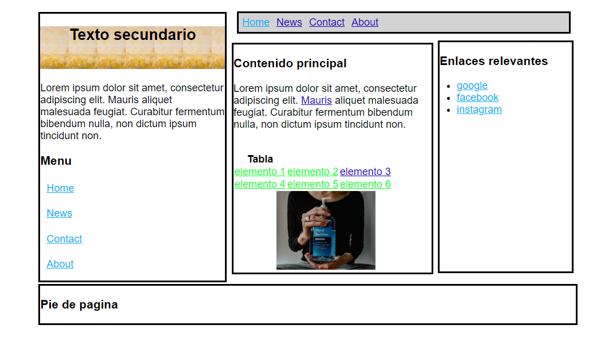

# Introducción a CSS

## Resultado


## código css

```css
body {

    font-family: Arial, Helvetica, sans-serif;
    font-size: 1.5em;
    font-color: black;
    width: 770px;
    position: relative;
    margin-left: 5%; 
    position: relative;
}

a{
  color: #03B2F3;
}

a:hover{
  color: #E83117;
}

a:visited{
  color: #1C00BD;
}

table a{
  color: #00FF1A;
}

p{
  margin-top: 0.5em
}

.texto_secundario {
    position: relative;
    top: -20px;
    border-style: solid;
    width: 430px;
}


.texto_secundario h2{
  height: 100px;
  background-image: url(img/cabecera.jpg);
  background-size: contain;
  text-align: center;
}

.texto_secundario .menu *{
  padding: 0.3em;
  margin-bottom: 0.7em;
}

.nav {
    width: 100%;
    margin: auto;
    border-style: solid;
    position: relative;
    left: 60%;
    top: 30px;
    background: lightgrey;
}

.nav li:hover{ /*no si los elementos seran li*/
  background-color: grey;
}


.nav ul {
  list-style-type: none;
  margin: 0;
  padding: 0;
  overflow: hidden;
}

.nav li {
    float: left;
}

.nav li a {
  display: block;
  padding: 8px;
  /*background-color: */
}


.texto_secundario ul {
    list-style-type: none;
    margin: 0;
    padding: 0;
}

.pie_pagina {
    border-style: solid;
    

}

main{
  position: relative;
}   

.contenido_principal {
  width: 60%;
  position: relative;
  border-style: solid;
  left: 450px;
  top: -580px;
}

.enlaces {
  width: 40%;
  margin-top: -111px;
  border-style: solid;
  position: relative;
  left: 930px;
  top: -1015px;
  padding-bottom: 340px;
}

footer{
  width: 163%;
  display: block;
  position: relative;
  margin-top: -990px;
}


.main-images img{
    width: 50%;
    display: inline-block;
    padding-left: 100px;
}

/*------------------------------------*/


© 2020 GitHub, Inc.
Terms
Privacy
Security
Status
Help
Contact GitHub
Pricing
API
Training
Blog
About

```

## HTML

```html
<!DOCTYPE html>
<html lang="">

    <head>
        <meta charset="utf-8">
        <title>Example Title</title>
        <meta name="author" content="Your Name">
        <meta name="description" content="Example description">
        <meta name="viewport" content="width=device-width, initial-scale=1.0">
        <link rel="stylesheet" href="main.css">
        <link rel="icon" type="image/x-icon" href=""/>
    </head>

    <body>
        <header>
            <div class="nav">
                <ul>
                    <li><a href="#Home">Home</a></li>
                    <li><a href="#News">News</a></li>
                    <li><a href="#Contact">Contact</a></li>
                    <li><a href="#About">About</a></li>
                </ul>
            </div>
        </header>
        <main>
            <div class="texto_secundario">
                <h2>Texto secundario</h2>
                <p>
                    Lorem ipsum dolor sit amet, consectetur adipiscing elit. Mauris aliquet malesuada feugiat. Curabitur fermentum bibendum nulla, non dictum ipsum tincidunt non.
                </p>

                <h3>Menu</h3>
                <ul class="menu">
                    <li><a href="default.asp">Home</a></li>
                    <li><a href="news.asp">News</a></li>
                    <li><a href="contact.asp">Contact</a></li>
                    <li><a href="about.asp">About</a></li>
                </ul>
            </div>
            <div class="contenido_principal">
                <h3>Contenido principal</h3>
                <div class="main-text">
                        <p>Lorem ipsum dolor sit amet, consectetur adipiscing elit. <a href="#1">Mauris</a> aliquet malesuada feugiat. Curabitur fermentum bibendum nulla, non dictum ipsum tincidunt non. </p>

                        <div class="data">
                            <table>
                                <th>Tabla</th>
                                <tr>
                                    <td><a href="#elemento1">elemento 1</a></td>
                                    <td><a href="#elemento2">elemento 2</a></td>
                                    <td><a href="#elemento3">elemento 3</a></td>
                                </tr>
                           <tr>
                                    <td><a href="#elemento4">elemento 4</a></td>
                                    <td><a href="#elemento5">elemento 5</a></td>
                                    <td><a href="#elemento6">elemento 6</a></td>
                                </tr>

                            </table>
                            <div class="main-images">
                                
                            </div>
                        </div>  
                </div>

            </div>
            <div class="enlaces">
                <h3>Enlaces relevantes</h3>
                <ul>
                    <li><a href="www.google.com">google</a></li>
                    <li><a href="www.facebook.com">facebook</a></li>
                    <li><a href="www.instagram.com">instagram</a></li>
                </ul>
            </div>
        </main>
        <footer>
            <div class="pie_pagina">
                <h3>Pie de pagina</h3>
            </div>
        </footer>
        <script type="text/javascript" src=""></script>
    </body>

</html>
```
