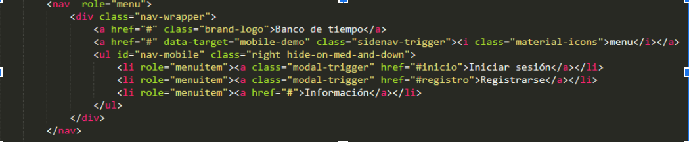
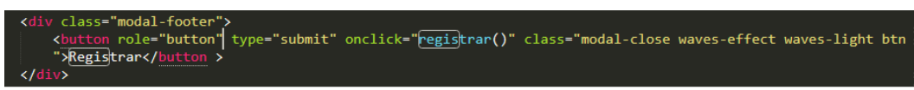
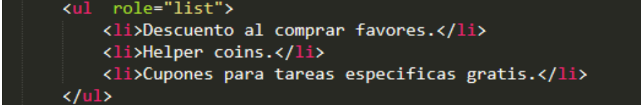
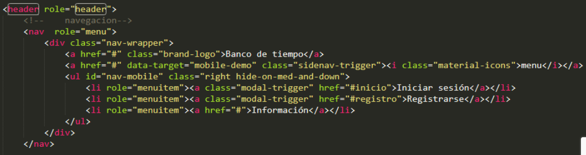
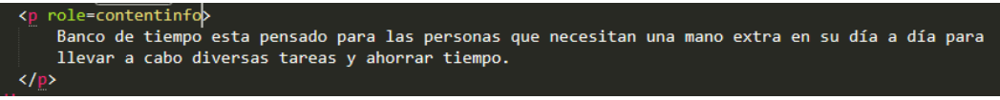

# Ejercicio WAI-ARIA

## Integrantes

- Leonardo Dorta Bejarano
- Elvis Nogueiras Gonzalez
- Daniel Arbelo Hernandez

## Roles

 ### Roles de Widget

Hemos agregado Algunos Roles de Widget:

- Roles en los menús, así como sus items

- Roles en los botones

### Roles de Estructura

Roles en listas

### Roles de Referencia

Header

Contentinfo

## Estados y Propiedades

### tabindex

tabindex = "1" para actualizar lo elementos que no recibían el foco

En nuestro caso, uno de estos elementos es el boton de Registrar en el formulario, que al estas sobre el, no recibe el foco

Ahora, es posible seleccionar el botón

Por otro lado, tenemos contenido que no queremos que reciba el foco, en nuestro caso son los iconos

con tabindex = "-1" estos elementos ya no reciben el foco

#### Aria-required

Aria-required=”true” en los campos del formulario que son obligatorios, los cuales son
(*)Nombre: 
(*)Apellido:
(*)Género:
(*)Ciudad:
(*)Correo electrónico:
(*)Contraseña:
(*)repetir  la contraseña:

#### Aria label

Gracias a esto se con el uso del chromevox, ahora se escucha el nombre del formulario

